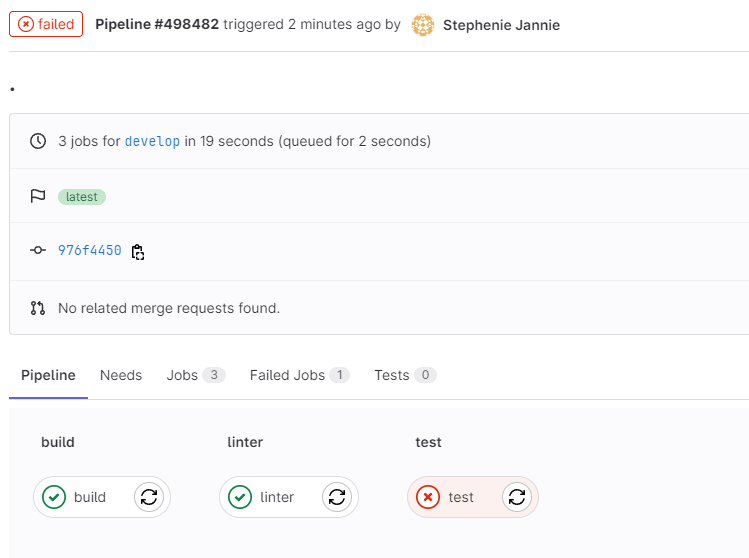
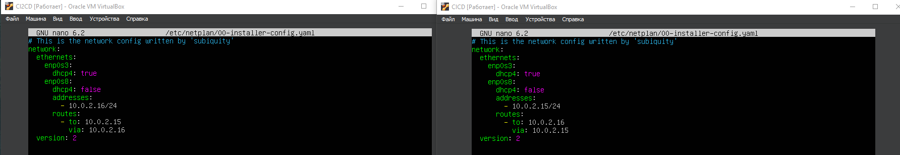
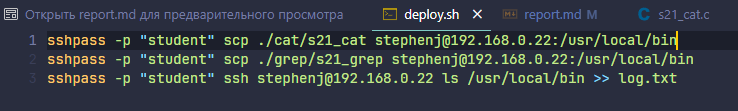

# Basic CI/CD

### Part 1. Настройка **gitlab-runner**

>**== Задание ==**
>
>##### Подними виртуальную машину Ubuntu Server 22.04 LTS.*
>*Будьте готовы, что в конце проекта нужно будет сохранить дамп образа виртуальной машины*

>##### Скачать и установить на виртуальную машину **gitlab-runner**
- 
>##### Запустить **gitlab-runner** и зарегистрировать его для использования в текущем проекте (*DO6_CICD*)
>- Для регистрации понадобятся URL и токен, которые можно получить на страничке задания на платформе.
- 

### Part 2. Сборка

>**== Задание ==**
>
>#### Написать этап для **CI** по сборке приложений из проекта *C2_SimpleBashUtils*:
>
>##### В файле _gitlab-ci.yml_ добавить этап запуска сборки через мейк файл из проекта _C2_
>
>##### Файлы, полученные после сборки (артефакты), сохранять в произвольную директорию со сроком хранения 30 дней.
- Скопировал папки cat и grep из проекта simpleBashUtils в папку src проекта CICD: 

- создал и описал файл .gitlab-ci.yml 
    - Файл .gitlab-ci.yml - это файл конфигурации для настройки и определения задач и пайплайнов непрерывной интеграции и непрерывной доставки (CI/CD) в GitLab. В этом файле вы описываете, какие шаги должны выполняться автоматически при каждом пуше кода в ваш репозиторий. После добавления .gitlab-ci.yml файла в ваш репозиторий, GitLab CI/CD будет автоматически создавать пайплайны и выполнять задачи согласно вашим настройкам. Вы сможете видеть результаты выполнения задач в веб-интерфейсе GitLab, а также настраивать уведомления, автоматическое развертывание и другие аспекты CI/CD процесса.

- 

- 

- 

### Part 3. Тест кодстайла

>**== Задание ==**
>
>#### Написать этап для **CI**, который запускает скрипт кодстайла (*clang-format*):
>
>##### Если кодстайл не прошел, то "зафейлить" пайплайн
- 
>##### В пайплайне отобразить вывод утилиты *clang-format*
- 
- 

### Part 4. Интеграционные тесты

>**== Задание ==**
>
>#### Написать этап для **CI**, который запускает ваши интеграционные тесты из того же проекта:
>
>##### Запускать этот этап автоматически только при условии, если сборка и тест кодстайла прошли успешно
>
>##### Если тесты не прошли, то "зафейлить" пайплайн
- Мои тесты возвращают 2 строки:  количество SUCCESS и FAIL тестов. Таким образом для фела пеплайна необходимо чтобы в строке FAIL было значение не 0, то есть хотябы 1 тест был зафейлен. Для этого в скрипте запускаем тесты и смотрим на строку FAIL, если она не равна 0, то роняем пеплайн.
- 
>##### В пайплайне отобразить вывод, что интеграционные тесты успешно прошли / провалились
-  
- 

### Part 5. Этап деплоя

>**== Задание ==**

`sudo apt-get install openvswitch-switch`
`sudo netplan apply`
>
>##### Поднять вторую виртуальную машину *Ubuntu Server 22.04.04 LTS*
- 
>#### Написать этап для **CD**, который "разворачивает" проект на другой виртуальной машине:
>##### Запускать этот этап вручную при условии, что все предыдущие этапы прошли успешно
- необходимо перенастроить сетевые адаптеры обеих машин следующим образом:

- 
- 

сгенерировать  ssh `ssh-keygen` ключ. Полученный ключ необходимо внести в файл /.ssh/authorized_keys на удаленном сервере командой `ssh-copy-id user@host` и если возникает ошибка доступа при переноса файлов, нужно делать пользователя, под которым заходишь на вторую машину владельцем директории в которую переносишь файлы `sudo chown -R $(whoami) `.
- добавили на вторую машину ssh ключ ((в первой машине))`sudo su gitlab-runner` `ssh-copy-id stephenj@192.168.0.22`

- 
>##### Написать bash-скрипт, который при помощи **ssh** и **scp** копирует файлы, полученные после сборки (артефакты), в директорию */usr/local/bin* второй виртуальной машины

- 
>##### В файле _gitlab-ci.yml_ добавить этап запуска написанного скрипта

- 
>##### В случае ошибки "зафейлить" пайплайн
>##### Запуск вручную с помощью manual

- 
- 
>В результате вы должны получить готовые к работе приложения из проекта *C2_SimpleBashUtils* (s21_cat и s21_grep) на второй виртуальной машине.

### Part 6. Дополнительно. Уведомления

**== Задание ==**

##### Настроить уведомления о успешном/неуспешном выполнении пайплайна через бота с именем "[ваш nickname] DO6 CI/CD" в *Telegram*
- первым делом необходимо получить токен бота. Для этого используем инфраструктуру телеграма, а точнее главного бота "BotFather". Выполняем команды указаные ниже и получаем токен.
- 
- 
- далее необходимо получить id чата. Для этого в адресной строке браузера забиваем `https://api.telegram.org/bot<YOUR_BOT_TOKEN>/getUpdates`, уже находясь на указанной странице отправьте любое сообщение в чат бота. На странице отобразятся данные, включая id чата в который вы отправили сообщение (поле chat->id):
- 
- далее пишем скрипт который будет контролировать работу каждого этапа CI/CD:
- добавляем выполнение скрипта после каждого этапа, итоговый файл .gitlab-ci.yml выглядит так:
- 
- коммитим, пушим и проверяем работу бота
- 

