# D01_Linux

## Parts
1. [Part 1. Установка ОС](#part-1-установка-ос)
2. [Part 2. Создание пользователя](#part-2-создание-пользователя)
3. [Part 3. Настройка сети ОС](#part-3-настройка-сети-ос)
4. [Part 4. Обновление ОС](#part-4-обновление-ос)
5. [Part 5. Использование команды sudo](#part-5-использование-команды-sudo)
6. [Part 6. Установка и настройка службы времени](#part-6-установка-и-настройка-службы-времени)
7. [Part 7. Установка и использование текстовых редакторов](#part-7-установка-и-использование-текстовых-редакторов)
8. [Part 8. Установка и базовая настройка сервиса SSHD](#part-8-установка-и-базовая-настройка-сервиса-sshd)
9. [Part 9. Установка и использование утилит top, htop](#part-9-установка-и-использование-утилит-top-htop)
10. [Part 10. Использование утилиты fdisk](#part-10-использование-утилиты-fdisk)
11. [Part 11. Использование утилиты df](#part-11-использование-утилиты-df)
12. [Part 12. Использование утилиты du](#part-12-использование-утилиты-du)
13. [Part 13. Установка и использование утилиты ncdu](#part-13-установка-и-использование-утилиты-ncdu)
14. [Part 14. Работа с системными журналами](#part-14-работа-с-системными-журналами)
15. [Part 15. Использование планировщика заданий CRON](#part-15-использование-планировщика-заданий-cron)

## Part 1. Установка ОС

>Обязательно скачиваем образ сервера

`-` После ддлительной установки запускаем машину и вводим `cat /etc/issue`

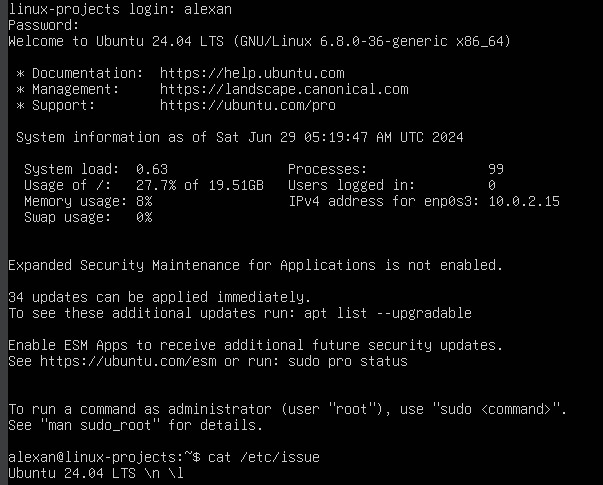

## Part 2. Создание пользователя

**- Без sudo эту команду не выполнить -**

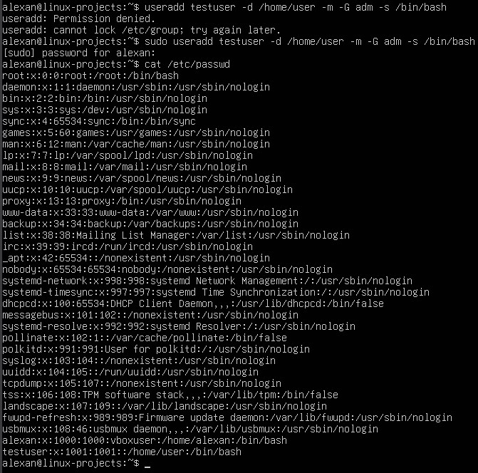

## Part 3. Настройка сети ОС

- Про настройку сетей подробнее можно узнать тут `https://linuxwin.ru/kak-nastroit-staticheskiy-ip-adres-v-ubuntu-20-04-lts/`

`-` Задание 1

- sudo nano /etc/hostname

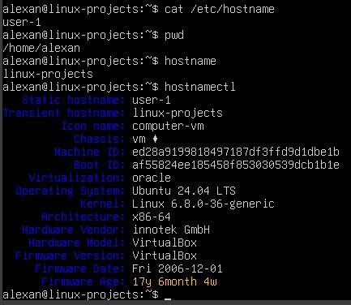

`-` Задание 2

`-` Задание 3

- IO-Link - это недорогая, простая в реализации система связи, разработанная для упрощения соединений между крупномасштабными сетями fieldbus или промышленными сетями Ethernet и датчиками или исполнительными устройствами, расположенными на заводе.

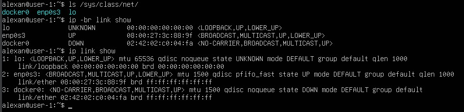

`-` Задание 4 

- Для получения ip адересов используется команда ip address \
- DHCP (Dynamic Host Configuration Protocol) - cетевой протокол, позволяющий сетевым устройствам автоматически получать IP-адрес и другие параметры, необходимые для работы в сети TCP/IP

`-` Задание 5

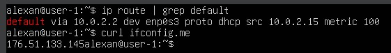

`-` Задание 6

- Так получилось что шагов настроки много и описывать все это тут было бы слишком много текста, поэтому эта статья опишет вам все шаги  `https://linuxwin.ru/kak-nastroit-staticheskiy-ip-adres-v-ubuntu-20-04-lts/`

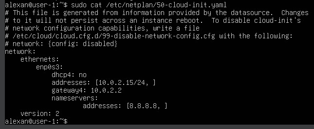

`-` Задание 7

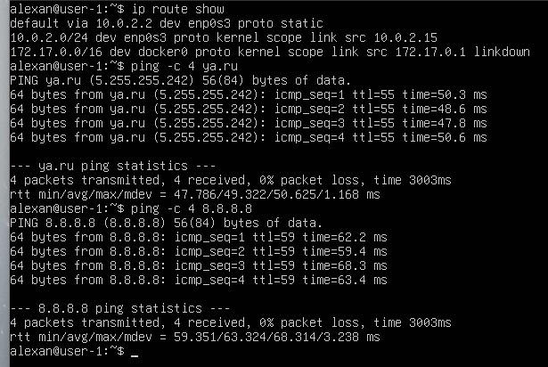

## Part 4. Обновление ОС

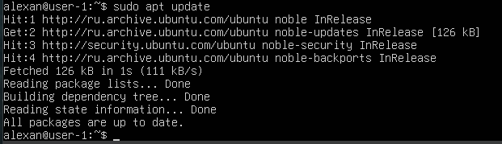

## Part 5. Использование команды sudo

- Команда sudo предоставляет возможность пользователям выполнять команды от имени суперпользователя root, либо других пользователей. Правила, используемые sudo для принятия решения о предоставлении доступа, находятся в файле /etc/sudoers

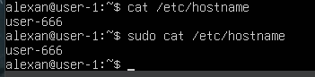

## Part 6. Установка и настройка службы времени

## Part 7. Установка и использование текстовых редакторов

1.

- JOE - для выхода "control + k", затем "q" и подтвердить сохранение "y"

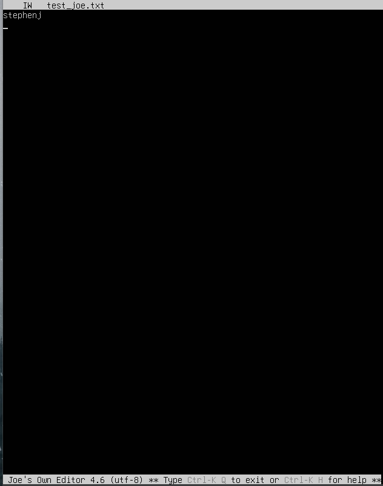

- VIM - для выхода из режима редактирования используется "esc" после ":" и команда "qw"

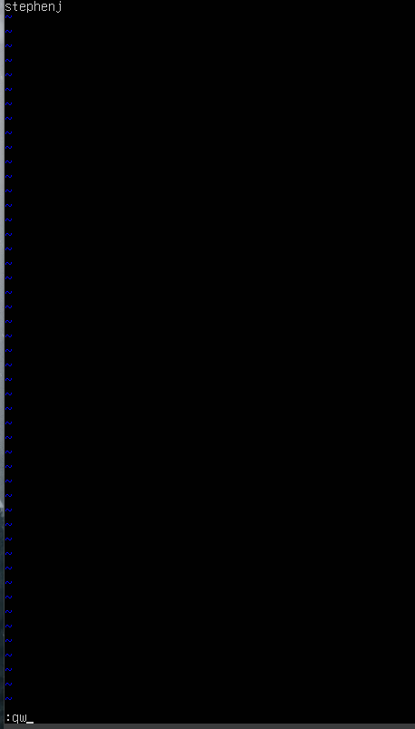

- NANO - для "control + x" для выхода "y" для подтверждения сохранения

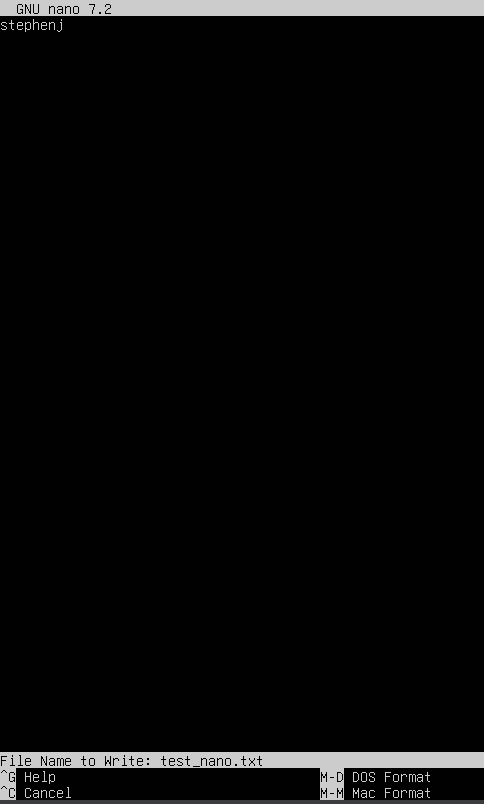

2.

- JOE - для выхода "control + k", затем "q" и отменить сохранение "n"

- VIM - для выхода из режима редактирования используется "esc" после ":" и команда "q!" для выхода без сохранения изменений

- NANO - для "control + x" для выхода "n" для отмены сожранений

3.

- JOE - для поиска и замены слов в файле "control + k", затем "f". Далее воодится слово для замены, нажимается "R" и вводится на что менять слово.

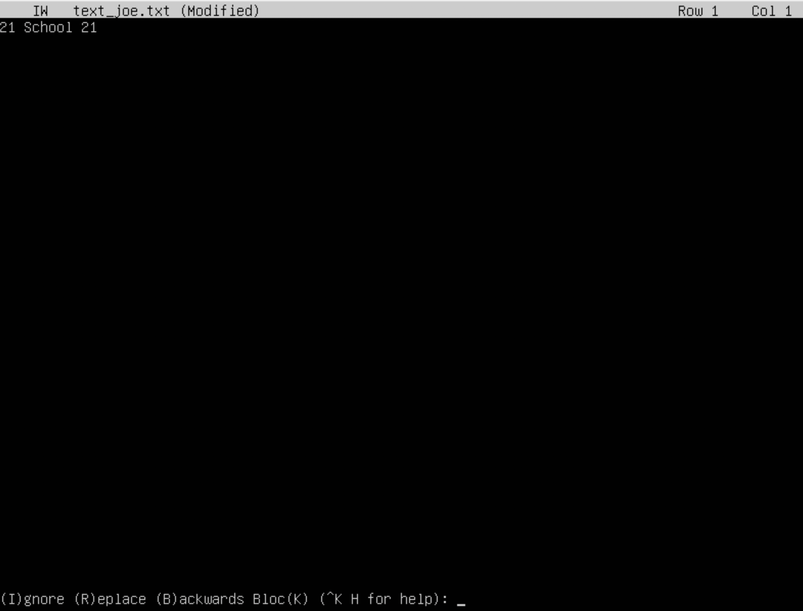

- VIM - для поиска используется команда "/" c перемещением посредством "n" и "N"
для замены команда ":s/патерн посика/замена" 

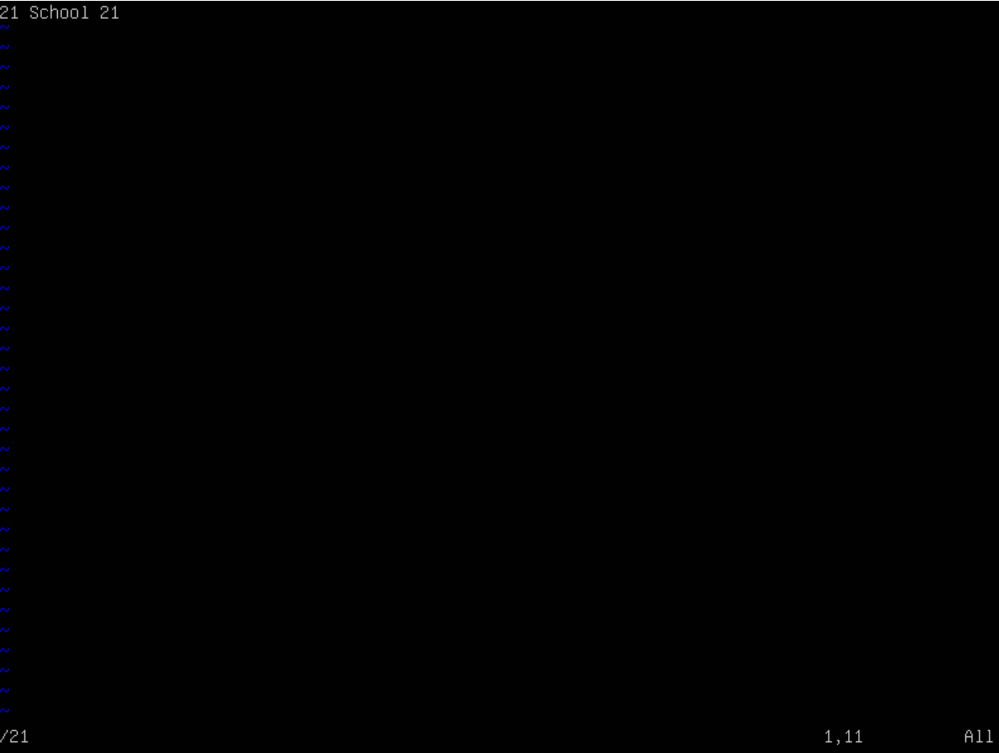

- NANO - для поиска control + w для замены control +

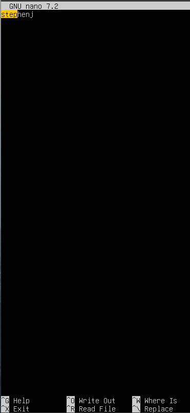

## Part 8. Установка и базовая настройка сервиса SSHD

- Для установки SSH и запуска соответствующего дaемона выполнена команда: sudo apt install ssh

- Для добавления автоматического запуска демона ssh при загрузке системы использовалась команда: sudo systemctl enable ssh

- Для перенастройки службы SSHd на порт 2022 необходимо было отредактировать файл: /etc/ssh/sshd_config . Я делал это через nano, раскоментировав строку с портом и заменив его на 2022

- `sudo systemctl enable ssh`

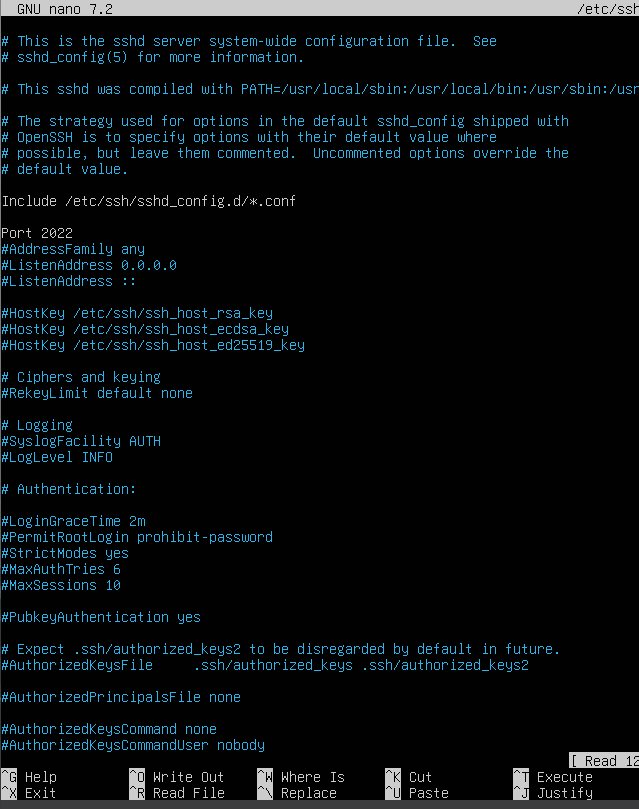

- Для вывода даемона ssh использовалась команда: ps -aux | grep ssh 

- Параметр a указывает ps отображать процессы всех пользователей. Не отображаются только процессы, не связанные с терминалом, и процессы руководителей групп.
- u обозначает ориентированный на пользователя формат, который предоставляет подробную информацию о процессах.
- Параметр x указывает ps перечислить процессы без управляющего терминала. В основном это процессы, которые запускаются во время загрузки и работают в фоновом режиме . 

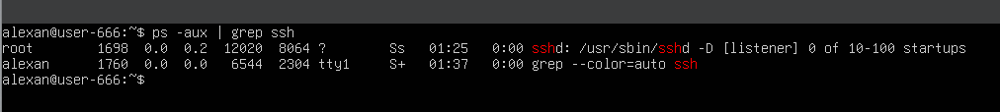

- Вывод команды: netstat -tan

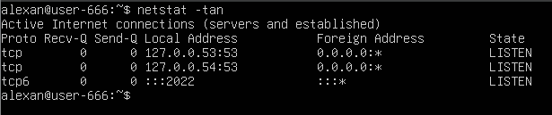

- t информация по протоколам TCP;
- a Показывает состояние всех сокетов; обычно сокеты, используемые серверными процессами, не показываются.
- n Показывает сетевые адреса как числа. netstat обычно показывает адреса как символы. Эту опцию можно использовать с любым форматом показа. 

1. Proto - протокол TCP или UDP
2. Recv-Q - Счётчик байт не скопированных программой пользователя из этого сокета
3. Send-Q - Счётчик байтов, не подтверждённых удалённым узлом
4. Local Address - IP -адрес локального компьютера и номер используемого порта
5. Foreign Address - IP -адрес и номер порта удалённого компьютера, к которому подключен сокет если есть *, значит порт ещё не установлен
6. State - указывает состояние TCP - соединения 

## Part 9. Установка и использование утилит top, htop

- Uptime – это время непрерывной доступности ресурса (сайта/хостинга/сервера) `(31 min)`
- Количество авторизованных пользователей `1`
- Общую загрузку системы за мин: `0.00 за 5: 0.01 за 15: 0.01`
- Общее количество процессов - `94`
# Загрузка cpu:
- Процент времени процессора, затраченного на выполнение пользовательских процессов (us) `0.0`
- Процент времени процессора, затраченного на выполнение процессов ядра (sy) `0.4`
- Процент времени процессора, затраченного на выполнение пользовательских процессов с ограничениями (ni) `0.0`
- Процент времени процессора проведённое в режиме ожидания (id) `99.2`
- Процент времени процессора потраченное на ожидание на периферийных устройствах (wa) `0.0`
# Загрузка памяти:
- Физическая память (Mem)
- Общий объем ОЗУ (total) `2958.2`
- Количество свободной памяти (free) `2269.2`
- Количество занятой памяти (used) `378.5`
- Зарезервированная системой память (buff/cache) `462.6`
# Виртуальная память или пространство подкачки (Swap)
- Общий объем ОЗУ (total) `2958.0`
- Количество свободной памяти (free) `2958.0`
- Количество занятой памяти (used) `0.0`
- Память который может быть выделена для процессов, не используя большую область диска (avail Mem) `2579.7`
- Pid процесса занимающего больше всего памяти `1.0%` от общего количества (сортировка по SHIFT + P(первый процесс))
- Pid процесса, занимающего больше всего процессорного времени `0:04:01` (сортировка по SHIFT + M(первый процесс))

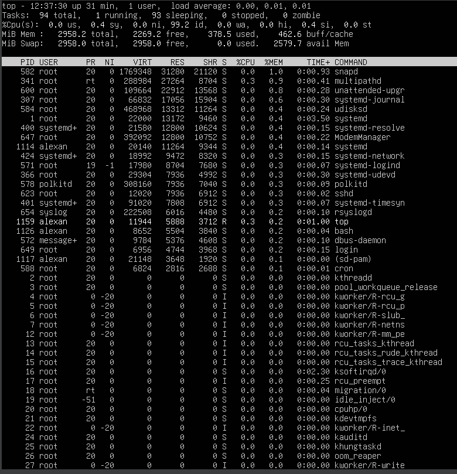

# HTOP

>В htop для сортировки процессов по разным параметрам: 

>PID: нажмите F6 и выберите PID. \
>%CPU: нажмите F6 и выберите %CPU. \ 
>%MEM: нажмите F6 и выберите %MEM. \
>TIME: нажмите F6 и выберите TIME+. \
>Также можно использовать клавиши < и > для переключения между столбцами. 

`-` Сортировка по PID в `htop`

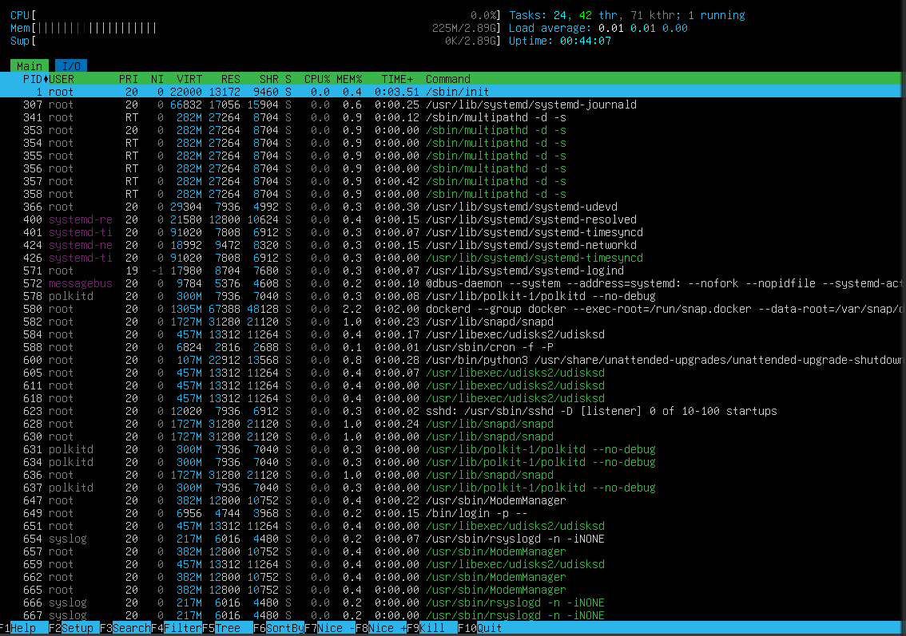

`-` Сортировка по PERCENT_CPU в `htop`

`-` Сортировка по PERCENT_MEM в `htop`

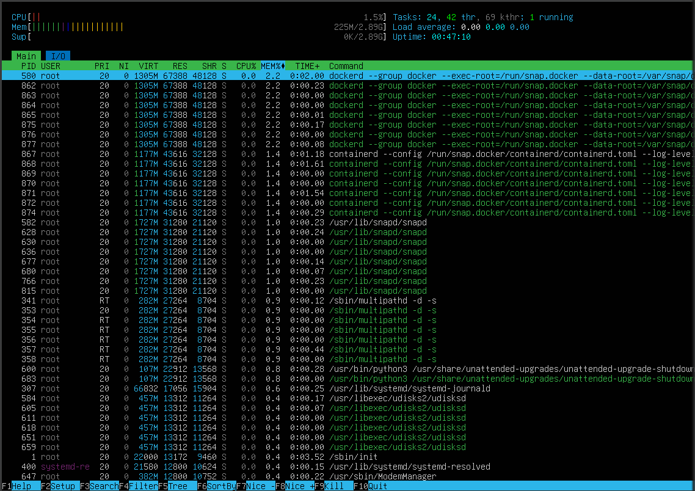

`-` Сортировка по TIME в `htop`

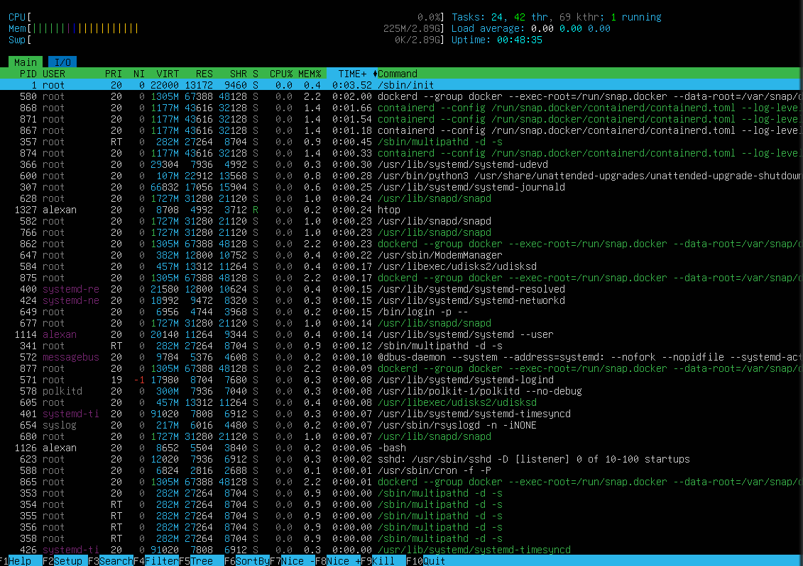

`-` Фильтр для процесса(ов) SSHD в `htop`

>F4 + sshd in search 

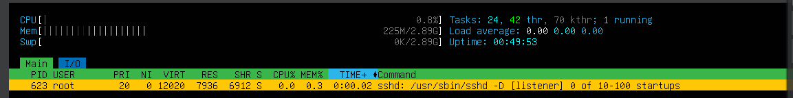

`-` Процесс SYSLOG в `htop`

>F3 and syslog in search

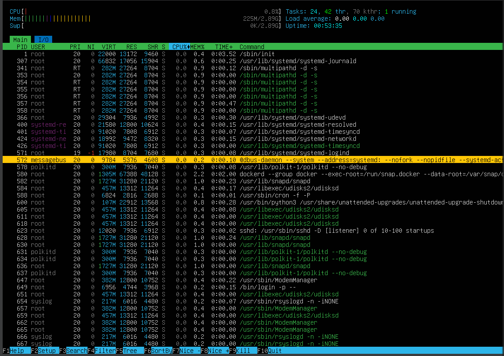

`-` Вывод UPTIME, CLOCK и HOSTNAME в `htop`

>Нажмите F2 (Setup). \
>Перейдите в раздел "Meters". \
>Добавьте "Hostname", "Clock", и "Uptime" из левой панели в верхние или нижние колонтитулы.\
>Нажмите F10 для сохранения.

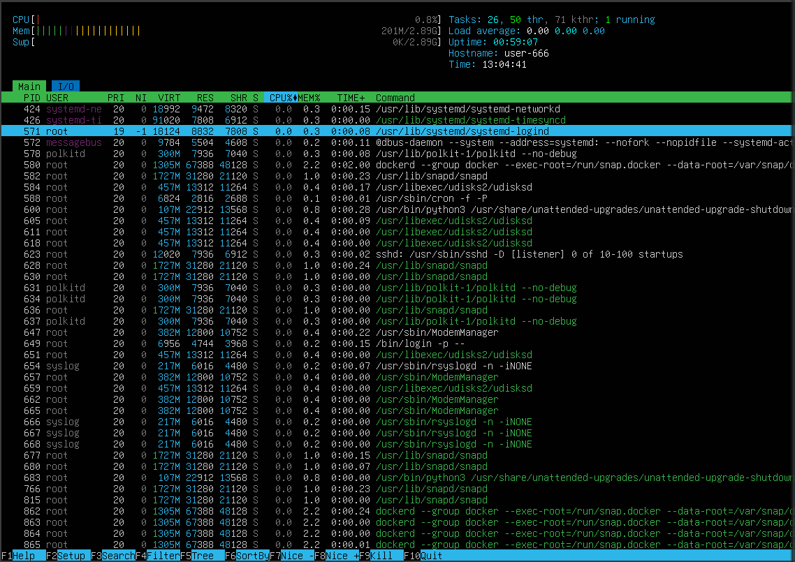

## Part 10. Использование утилиты fdisk

- Название жёсткого диска sda
- Его размер 20 GiB
- Количество секторов на диске 41943040
- Размер swap 369 MiB 

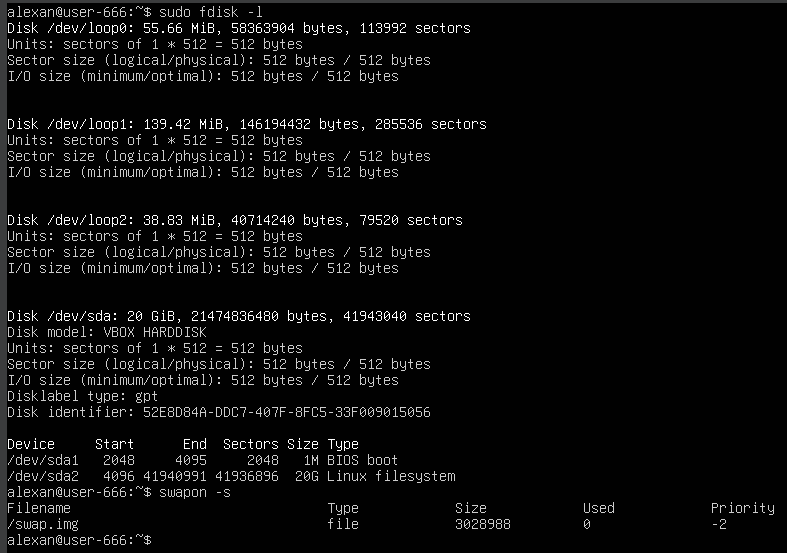

## Part 11. Использование утилиты df

- Размер раздела 20463184 KiB
- Размер занятого пространства 5865936 KiB
- Размер свободного пространства 13522444 KiB
- Процент использования 31% 

- Размер раздела 20.0 GiB
- Размер занятого пространства 5.6 GiB
- Размер свободного пространства 13.0 GiB
- Процент использования 31% 

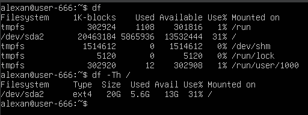

## Part 12. Использование утилиты du

- `sudo du -h /home`

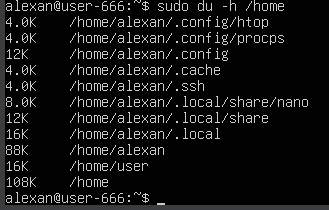

- `sudo du -h /var` 

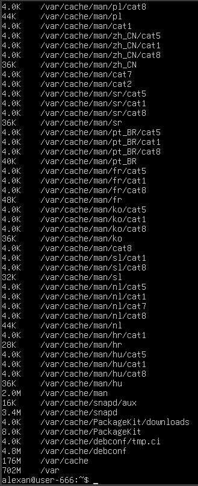

- `sudo du -h /var/log` 

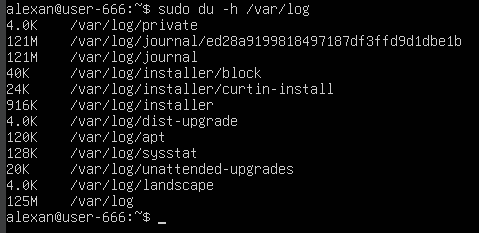

- `sudo du -h /var/log/*` 

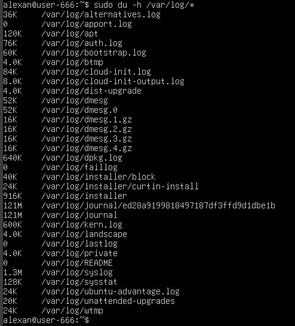

## Part 13. Установка и использование утилиты ncdu

- `ncdu /home` 

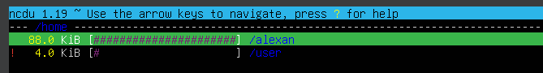

- `ncdu /var` 

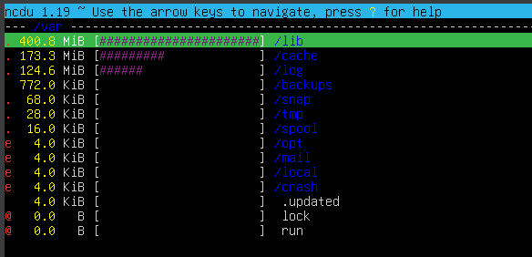

- `ncdu /var/log` 

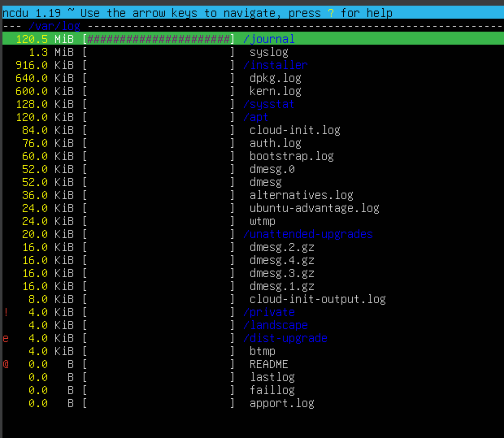

## Part 14. Работа с системными журналами

- Лог последнего входа 
- Время последней успешной авторизации - 2024-06-29T05:19:49.142792 + 00:00 
- Имя пользователя - alexan 
- Способ входа аутентификации в режиме pam_unix 

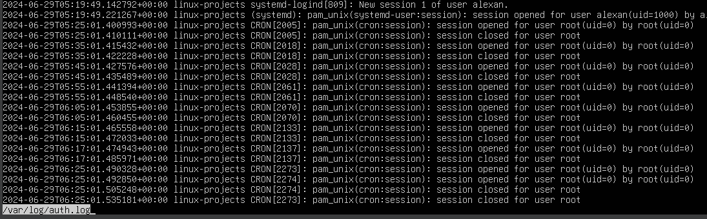

- Реастарт SSH системы 

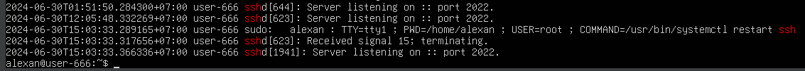

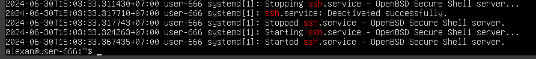

## Part 15. Использование планировщика заданий CRON

- Измененный CRON

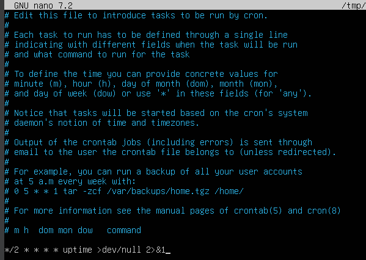

- UPTIME CRON - **logs**

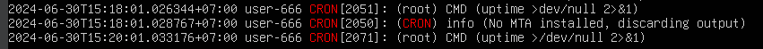

- Очищенный CRON 

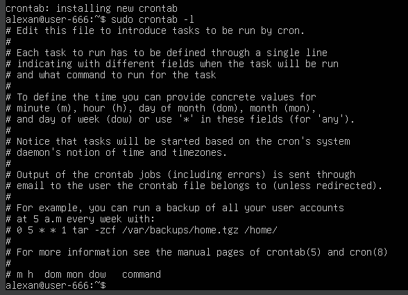

